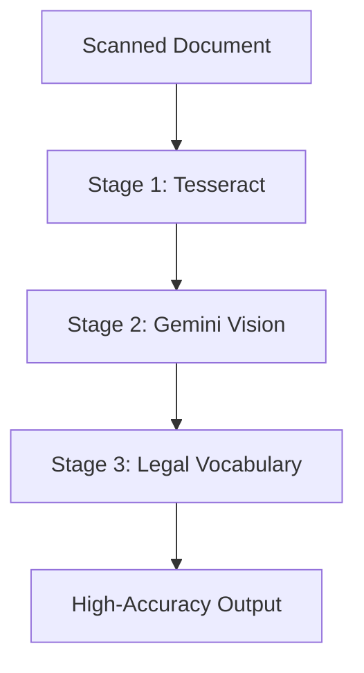

# OCR Pipeline Architecture

## The Challenge

Legal documents in India often contain:
- Mixed scripts (Gujarati + English)
- Low-quality scans from 1970s-present
- Handwritten annotations
- Faded text and stamps

Standard OCR fails on 40%+ of these documents.

---

## 3-Stage Solution

### Stage 1: Tesseract Base OCR

- Languages: `guj+eng` (Gujarati + English)
- Baseline accuracy: ~78%
- Fast processing: ~2s/page

### Stage 2: Gemini Vision Correction

- Uses multimodal LLM to fix OCR errors
- Compares OCR text against actual image
- Resolves ambiguous characters

### Stage 3: Legal Vocabulary

Domain-specific corrections for:
- Property terms (Survey No., Registration No.)
- Document types (Faragati Lekh, Sale Deed)
- Legal phrases in both languages

---

## Benchmarks

| Method | Accuracy | Time/Page |
|:---|:---|:---|
| Tesseract alone | 78.2% | 2s |
| + Gemini Vision | 94.6% | 8s |
| + Legal Vocabulary | **96.8%** | 12s |

*Tested on 100 scanned deeds (1970-2025)*

---

## Author

**Swetang Gajjar** - Senior AI Engineer

Developed while processing 50,000+ Gujarati legal scans.
